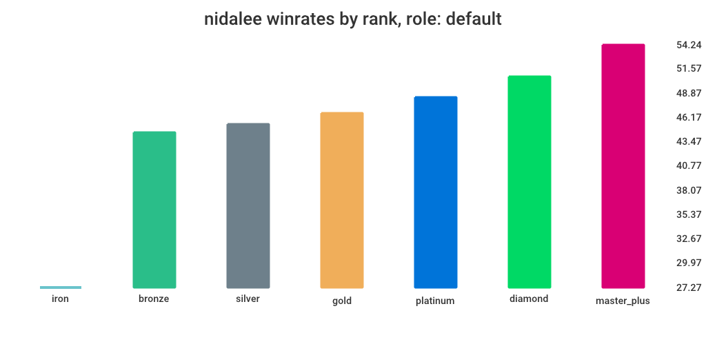
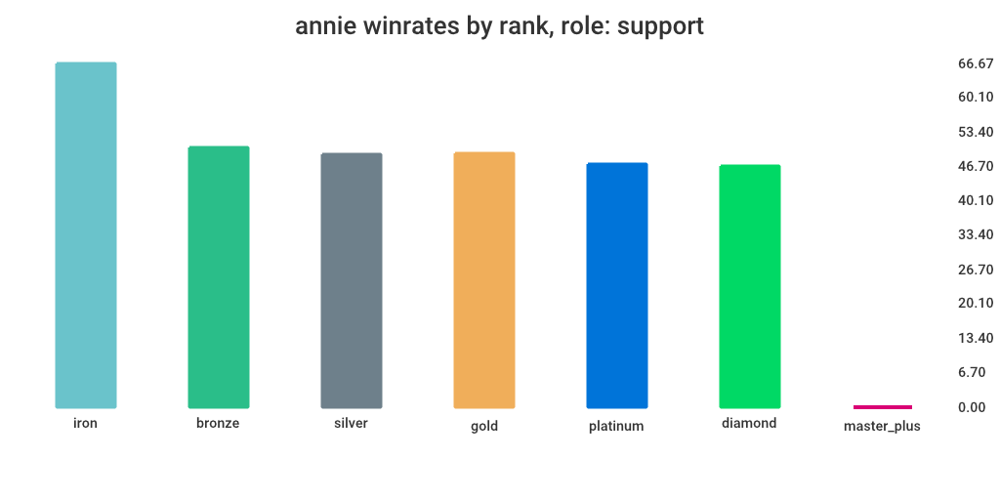
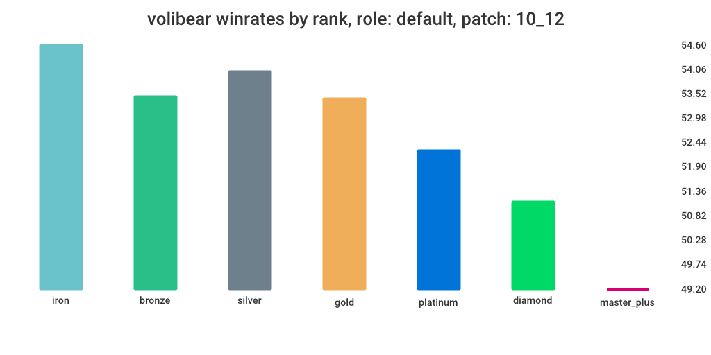

# ugg-scrapper
u.gg scrapper to make winrate graphs

## Install
Requires go installed

```
go install github.com/j4rv/ugg-scrapper/bin/ugg-scrapper
```

## How to use
Nidalee on her default role:

```
ugg-scrapper -champ nidalee
```



Annie on support:

```
ugg-scrapper -champ annie -role support
```



Volibear at patch 10.12 (default role: jungle):

```
ugg-scrapper -champ volibear -patch 10_12
```



## Libraries credits
- [github.com/gocolly/colly](https://github.com/gocolly/colly)
- [github.com/wcharczuk/go-chart.](https://github.com/wcharczuk/go-chart)